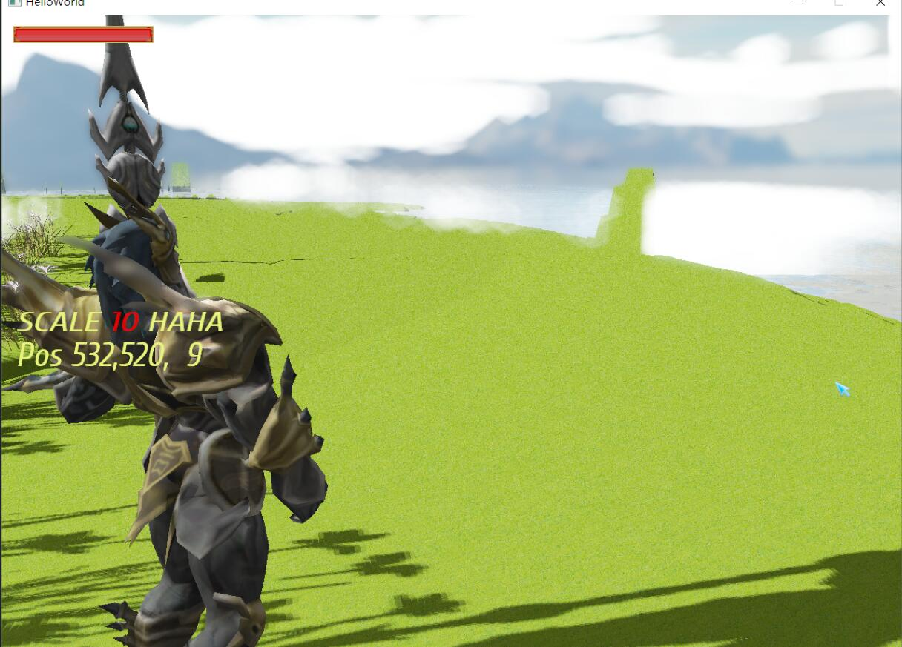

# CGTEST

7.29更新naive的bokeh实现，效率堪忧，一个点要重新采样2000+次，而且效果不怎么好。

## Done
- 法线模拟水面
- Directional Light && Point Light，仅对DL进行了阴影处理
- 基于Instance的植被
- half-copy的骨骼动画和动画融合
- 很微妙的法线贴图实现
- 很偷懒的HDR
- 地形
- 还没有改写实例化的粒子
- GUI

## TODO
-  SSAO（half failed）
-  比较geometry-level的水面渲染
-  全局光照
-  之前完全不懂shared_ptr的时候写的一个完全错误的cache。。丢人

